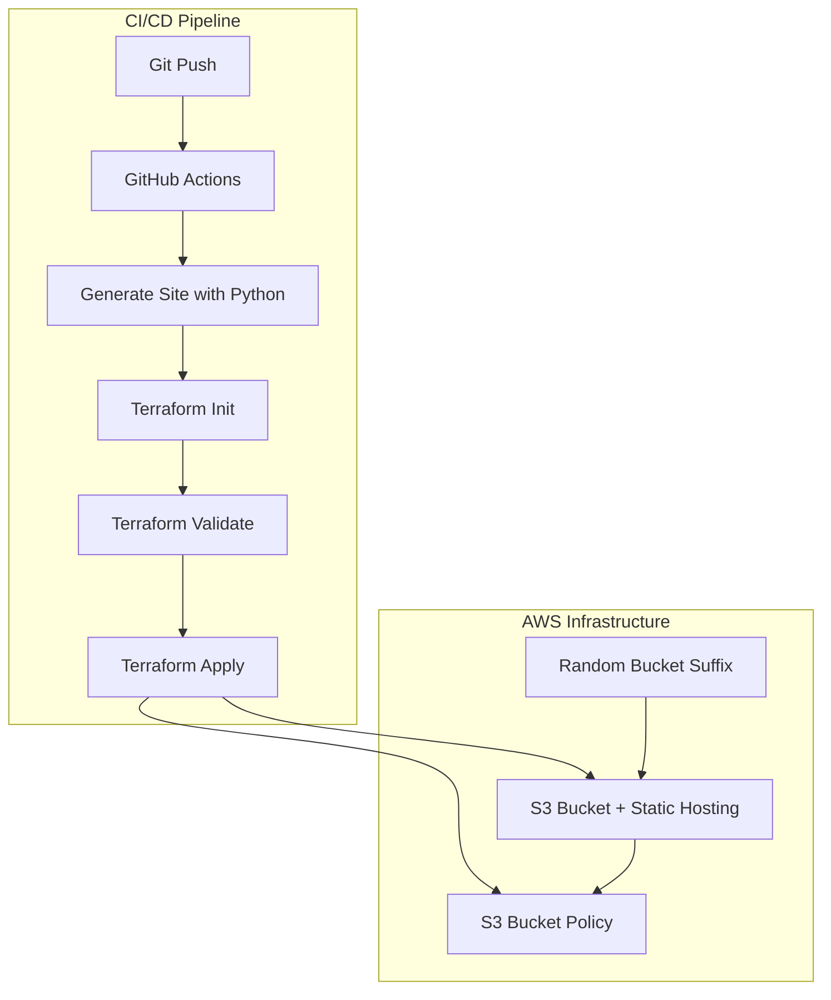

# 🚀 Serverless Portfolio

The infrastructure behind [joshcoffey.dev](https://joshcoffey.dev) — a static website hosted on AWS S3, provisioned with Terraform, and deployed automatically through GitHub Actions.

> **The story:** I built my portfolio site and then asked myself — *"why would I deploy this manually when I automate everything else?"* So I automated the entire infrastructure. Every AWS resource is defined in Terraform, and every push to main triggers a full build-and-deploy pipeline. No console clicks. No manual steps.

---

## 🏗️ Architecture



---

## 🧱 What's Provisioned

| Resource | Purpose |
|---|---|
| **S3 Bucket** | Static website hosting with random suffix for uniqueness |
| **S3 Website Configuration** | index.html + error.html routing |
| **S3 Public Access Block** | Configured for public read (static site) |
| **S3 Bucket Policy** | Public read access for serving site content |
| **S3 Ownership Controls** | BucketOwnerPreferred for consistent ACL behavior |
| **Random String** | 8-char random suffix to ensure globally unique bucket name |

---

## 📁 Repository Structure

```
serverless-portfolio/
├── terraform/                    # AWS infrastructure as code
│   ├── provider.tf               # AWS provider configuration
│   ├── variables.tf              # Input variables (region, bucket prefix)
│   ├── main.tf                   # S3 bucket, website config, policy, access block
│   ├── outputs.tf                # Outputs (bucket name, website URL)
│   └── .terraform.lock.hcl       # Locked provider versions
├── src/                          # Content generation pipeline
│   ├── content.md                # Markdown source for the website
│   ├── generate_site.py          # Python script: Markdown → HTML
│   ├── pyproject.toml            # Poetry dependency config
│   ├── poetry.lock               # Locked Python dependencies
│   └── .python-version           # Python 3.13
├── site/                         # Generated static site output
│   ├── index.html                # Homepage (generated)
│   └── error.html                # Custom 404 page
├── .github/workflows/
│   └── deploy.yml                # GitHub Actions CI/CD pipeline
├── .gitignore
├── .python-version
└── LICENSE                       # MIT
```

---

## 🚀 Quick Start

### Prerequisites

- [Terraform](https://www.terraform.io/downloads) >= 1.5
- [Python](https://www.python.org/) 3.13+ with [Poetry](https://python-poetry.org/)
- AWS CLI configured with appropriate credentials

### Generate the Site

```bash
cd src
poetry install
poetry run python generate_site.py
```

### Deploy Infrastructure

```bash
cd terraform
terraform init
terraform plan
terraform apply
```

### CI/CD

Push to `main` and GitHub Actions handles everything automatically.

---

## 🔄 CI/CD Pipeline

The `.github/workflows/deploy.yml` workflow runs on every push to `main`:

1. **Checkout** — pulls the latest code
2. **Setup Python 3.13** — prepares the content generation environment
3. **Install Poetry** — installs the Python dependency manager
4. **Install dependencies** — `poetry install` in the `src/` directory
5. **Generate website content** — runs `generate_site.py` to produce HTML from Markdown
6. **Terraform Init** — initializes the Terraform working directory
7. **Terraform Validate** — validates the Terraform configuration
8. **Terraform Apply** — provisions/updates AWS infrastructure
9. **Get Terraform Outputs** — extracts the S3 bucket name
10. **Sync to S3** — uploads generated site files to the S3 bucket

---

## 🔒 Security Notes

- **No committed secrets** — AWS credentials are stored as GitHub Actions secrets, not in code
- **Terraform state** — currently local state; for production use, configure S3 + DynamoDB remote backend
- **S3 public access** — the bucket policy allows public read for static hosting; this is intentional and scoped to `s3:GetObject` only
- **Future improvements** — add CloudFront CDN with HTTPS, WAF protection, and OIDC authentication for GitHub Actions

---

## 💡 What I Learned

- **Content-as-code.** Using Markdown as the source of truth and Python to generate HTML keeps the content maintainable. I can update my portfolio by editing a single Markdown file instead of wrestling with HTML templates.
- **Terraform for everything.** Even a simple S3 static site benefits from IaC. The bucket, policy, and website configuration are version-controlled, reviewable, and reproducible. No "it works on my account" mysteries.
- **Random suffix pattern.** S3 bucket names must be globally unique. Using `random_string` as a Terraform resource (rather than hardcoding) makes the configuration portable across AWS accounts without naming conflicts.
- **Poetry > pip.** Managing Python dependencies with Poetry gives me deterministic builds and a clean `pyproject.toml` instead of scattered requirements files.

---

## 🔗 Related Repos

- [**joshcoffey.dev**](https://github.com/hotcoffey/joshcoffey.dev) — the React + TypeScript frontend that powers the main portfolio site

---

## 📄 License

MIT — use this as a starting point for your own serverless portfolio!
